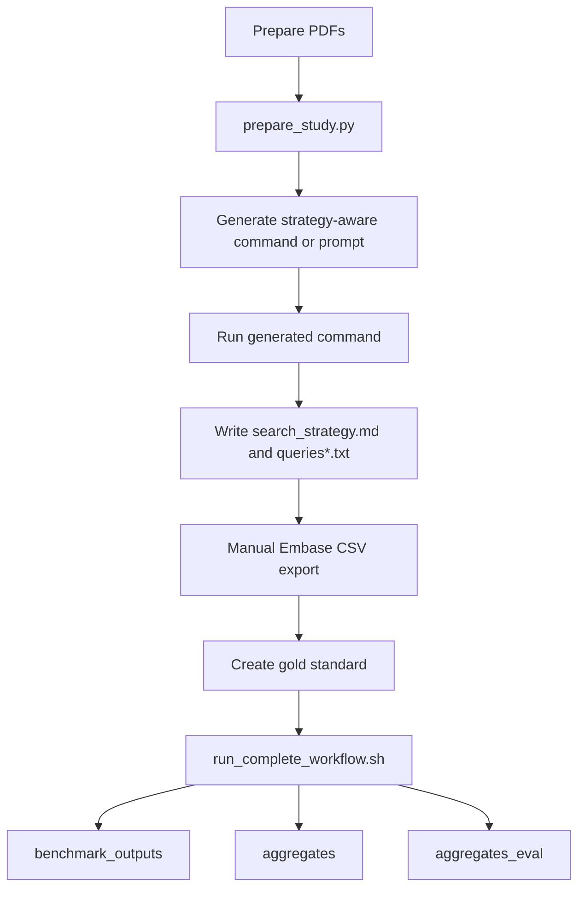

# LLM-Assisted Multi-Database Systematic Review Automation

**An end-to-end automated workflow for systematic literature reviews across PubMed, Scopus, Web of Science, and Embase.**

This repository provides tools to:
- 🤖 **Generate database-specific queries** using LLM from PROSPERO protocols
- 🔍 **Execute searches** across 4+ major databases with automatic API integration
- 🔄 **Deduplicate results** using DOI-based matching (~96% coverage)
- 📊 **Benchmark performance** against gold standard PMID lists
- 🎯 **Aggregate strategies** to optimize precision and recall
- ⚡ **Complete automation** from raw PDFs to final results in ~45-90 minutes

## 📚 Documentation

- **[Complete Pipeline Guide](Documentations/complete_pipeline_guide.md)** - Comprehensive technical walkthrough of all steps
- **[Automation Guide](Documentations/Automation_guide_main.md)** - End-to-end workflow from raw PDFs to results

## 🗂️ Repository Map

- `llm_sr_select_and_score.py` - Main CLI for query selection, scoring, and workflow execution
- `scripts/` - End-to-end workflow wrappers and helper utilities
- `cross_study_validation/` - Cross-study data collection, scoring, and visualization
- `studies/` - Per-study protocols, papers, search strategies, queries, and gold-standard artifacts
- `tests/` - Automated coverage for core workflow pieces

## 🚀 Quick Start

### One-Command Workflow
```bash
# Run complete workflow for a study
bash scripts/run_complete_workflow.sh Godos_2024 --databases pubmed,scopus,wos
```

### Core Commands
- **select**: Evaluate candidate queries without gold standard
- **score**: Benchmark queries against gold standard PMID list
- **finalize**: Add gold standard metrics to sealed results
- **score-sets**: Evaluate aggregation strategies
- **print-titles**: Fetch metadata for PMIDs

## 🛠️ Environment Setup

### 1. Install Conda and Clone Repository

```zsh
# Install Miniconda (if not already installed)
wget https://repo.anaconda.com/miniconda/Miniconda3-latest-MacOSX-arm64.sh
bash Miniconda3-latest-MacOSX-arm64.sh

# Clone repository
git clone https://github.com/ranibasna/QueriesSystematicReview.git
cd QueriesSystematicReview
```

### 2. Create Conda Environments

**Main environment** (for systematic review workflow):
```zsh
conda env create -f environment.yml
conda activate systematic_review_queries
# Update later if needed
conda env update -f environment.yml --prune
```

**Docling environment** (for PDF conversion):
```zsh
conda create -n docling python=3.11
conda activate docling
pip install docling
conda deactivate
```

### 3. Configure API Keys

You can provide credentials and defaults through either a local `.env` file or a copied config file:

```bash
cp sr_config.example.toml sr_config.toml
```

Create a `.env` file in the project root:

```bash
# .env file
# PubMed (free, but API key increases rate limit)
NCBI_EMAIL=your.email@institution.edu
NCBI_API_KEY=your_ncbi_api_key_optional

# Scopus (requires institutional subscription)
SCOPUS_API_KEY=your_scopus_api_key
SCOPUS_INSTTOKEN=your_institution_token_optional
SCOPUS_SKIP_DATE_FILTER=true

# Web of Science (requires institutional subscription)
WOS_API_KEY=your_wos_api_key

# Multi-database configuration (no spaces after commas!)
SR_DATABASES=pubmed,scopus,wos
```

**Where to get API keys:**
- **PubMed**: https://www.ncbi.nlm.nih.gov/account/settings/ (free)
- **Scopus**: Contact your institution's library
- **WOS**: Contact your institution's library

## 📋 Complete Workflow: From PDFs to Results

This workflow takes ~45-90 minutes per study (30-40 min automated, 15-50 min manual Embase).

### STEP 1: Convert PDFs to Markdown (5 min, automated)
```bash
python scripts/prepare_study.py Godos_2024 --docling-env docling
```

### STEP 2: Generate LLM Command (2 min, automated)
```bash
/generate_multidb_prompt \
  --command_name run_godos_2024_multidb_strategy \
  --protocol_path studies/Godos_2024/prospero_godos_2024.md \
  --databases pubmed,scopus,wos,embase \
  --relaxation_profile default \
  --min_date "1990/01/01" \
  --max_date "2023/12/31"
```

VS Code Copilot Chat provides the equivalent generator as `/generate-multidb-prompt`.

### STEP 3: Run LLM Command to Generate Queries (5 min, automated)
```bash
/run_godos_2024_multidb_strategy
```
This creates:
- `search_strategy.md` (architecture summary + concept tables + translation notes)
- `queries.txt` (6 PubMed queries)
- `queries_scopus.txt` (6 Scopus queries)
- `queries_wos.txt` (6 WOS queries)
- `queries_embase.txt` (6 Embase queries)

### STEP 4: Export Embase Results (10-30 min, manual)
1. Go to Embase.com
2. Run each query from `queries_embase.txt`
3. Export results as CSV
4. Place in `studies/Godos_2024/embase_manual_queries/`

### STEP 5: Create Gold Standard (5-30 min, automated)
```bash
python scripts/extract_included_studies.py Godos_2024 \
  --lookup-pmid \
  --generate-gold-csv
```

This creates both `gold_pmids_Godos_2024.csv` and `gold_pmids_Godos_2024_detailed.csv` for the downstream workflow.

### STEP 6: Run Complete Workflow (15-30 min, automated)
```bash
bash scripts/run_complete_workflow.sh Godos_2024 --databases pubmed,scopus,wos
```

Results will be in:
- `benchmark_outputs/Godos_2024/` - Individual query performance
- `aggregates/Godos_2024/` - Combined query strategies
- `aggregates_eval/Godos_2024/` - Strategy performance metrics

See [Automation Guide](Documentations/Automation_guide_main.md) for detailed instructions.

## 📊 Supported Databases

| Database | Status | API Required | Notes |
|----------|--------|--------------|-------|
| **PubMed** | ✅ Full support | Optional (increases rate limit) | Free via NCBI Entrez |
| **Scopus** | ✅ Full support | Yes | Institutional subscription required |
| **Web of Science** | ✅ Full support | Yes | Institutional subscription required |
| **Embase** | ⚠️ Manual export | No API | Export CSV from Embase.com manually |

## 🔄 Multi-Database Deduplication

**Automatic DOI-based deduplication** (Option A implemented):
- ~96% of modern articles have DOIs
- Eliminates duplicates across databases perfectly
- Logs deduplication statistics (e.g., "3,771 raw → 3,502 unique, 269 duplicates removed")
- See [deduplication documentation](Documentations/multi_database_deduplication_complete.md)

- Queries/queries.txt (UTF-8): one or more PubMed Boolean queries.
  - Separate queries with a blank line.
  - Lines inside a query block are concatenated with spaces.
  - Lines starting with `#` are comments and ignored.
  - Keep parentheses/quotes balanced; avoid proximity operators (NEAR/ADJ) for PubMed.
  - Do not hard-code date limits here; pass them via CLI/env/config instead.

Example (3 PubMed strategies, no date filters):
```
# High-recall
(("Sleep Apnea, Obstructive"[Mesh]) OR ("Obstructive Sleep Apnea"[tiab] OR "OSA"[tiab] OR "OSAHS"[tiab] OR "Sleep-Disordered Breathing"[tiab] OR "Sleep Apnea Hypopnea Syndrome"[tiab] OR "Upper Airway Resistance Syndrome"[tiab] OR "UARS"[tiab]))
AND
(("Microbiota"[Mesh]) OR (microbiome*[tiab] OR microbiota*[tiab] OR "gut flora"[tiab] OR "intestinal flora"[tiab] OR "oral flora"[tiab] OR "nasal flora"[tiab] OR dysbiosis[tiab] OR "alpha diversity"[tiab] OR "beta diversity"[tiab] OR "Shannon index"[tiab] OR "Simpson index"[tiab] OR "Chao1"[tiab]))
AND
(("Case-Control Studies"[Mesh]) OR ("case control*"[tiab] OR "case comparison*"[tiab] OR "case referent*"[tiab] OR retrospective*[tiab]))

# Balanced
(("Sleep Apnea, Obstructive"[Mesh:NoExp]) OR ("Obstructive Sleep Apnea"[tiab] OR "OSAHS"[tiab]))
AND
(("Microbiota"[Mesh]) OR (microbiome*[tiab] OR microbiota*[tiab] OR "gut flora"[tiab] OR "intestinal flora"[tiab]))
AND
(("Case-Control Studies"[Mesh]) OR ("case control"[tiab]))

# High-precision
("Sleep Apnea, Obstructive"[Mesh:NoExp] AND ("Gastrointestinal Microbiome"[Mesh] OR "gut microbiome"[tiab] OR "intestinal microbiome"[tiab]) AND "Case-Control Studies"[Mesh])
```

- concept_terms CSV: CSV with headers `concept,term_regex`; used to compute query concept coverage (regex applied to the raw Boolean text). Example file is provided and adapted for OSA + microbiome case–control.

### Provider-specific query files

The current strategy-aware generation workflow writes aligned database files directly into `studies/<study>/`:

- `queries.txt`
- `queries_scopus.txt`
- `queries_wos.txt`
- `queries_embase.txt`
- `search_strategy.md`

If you refine those files manually after generation, keep the same number of query blocks in the same order across databases. `scripts/run_complete_workflow.sh` validates that alignment before running full-set or query-level scoring.

## Configuration modes (precedence: CLI > ENV > CONFIG)

You can provide inputs by:
1) CLI flags
2) Environment variables (optionally in a `.env` file)
3) Config file via `--config` (TOML or JSON)

### Environment variables (.env)
Create `.env` (exact name). Example:
```
NCBI_EMAIL=you@example.com
# NCBI_API_KEY=your_api_key_here

SELECT_MINDATE=2015/01/01
SELECT_MAXDATE=2024/08/31
SELECT_CONCEPT_TERMS=concept_terms_OSA_microbiome_case_control.csv
SELECT_QUERIES_TXT=studies/your_study/queries.txt
SELECT_OUTDIR=sealed_outputs
# SELECT_TARGET_RESULTS=5000
# SELECT_MIN_RESULTS=50

# FINALIZE_SEALED_GLOB=sealed_outputs/sealed_*.json
# FINALIZE_GOLD_CSV=gold_pmids.csv

SCORE_MINDATE=2000/01/01
SCORE_MAXDATE=2024/08/31
SCORE_QUERIES_TXT=studies/your_study/queries.txt
SCORE_GOLD_CSV=studies/your_study/gold_pmids_your_study.csv
SCORE_OUTDIR=benchmark_outputs

# Multi-database controls
SR_DATABASES=pubmed,scopus,wos        # Comma-separated list of providers to run
SCOPUS_API_KEY=your_scopus_api_key    # Required when Scopus is enabled
# SCOPUS_INSTTOKEN=optional_insttoken  # Only needed for institutions requiring it
# SCOPUS_SKIP_DATE_FILTER=true         # Set to true to temporarily drop PUBYEAR filters
```
> Tip: provide secrets without surrounding quotes. If you have `SCOPUS_API_KEY="abc123"`, remove the quotes so the value is `SCOPUS_API_KEY=abc123`.
Note: the loader reads `.env`, not `.env.yaml`.

### Config file (TOML/JSON)
Copy and edit:
```zsh
cp sr_config.example.toml sr_config.toml
```
Then fill values, e.g.:
```toml
mindate = "2015/01/01"
maxdate = "2024/08/31"
concept_terms = "concept_terms_OSA_microbiome_case_control.csv"
queries_txt = "studies/your_study/queries.txt"
outdir = "sealed_outputs"
# target_results = 5000
# min_results = 50

[databases]
default = ["pubmed", "scopus", "wos"]

[databases.scopus]
enabled = true
api_key = "${SCOPUS_API_KEY}"
insttoken = "${SCOPUS_INSTTOKEN}"
view = "STANDARD"
# skip_date_filter = true
```
Pass it with `--config sr_config.toml`.

### Selecting databases

- Use `bash scripts/run_complete_workflow.sh <study>` as the main entry point. Its default database set is `pubmed,scopus,wos`.
- Override the provider set with `--databases pubmed,scopus,wos` when needed.
- Embase is not an API-backed provider in `llm_sr_select_and_score.py`. Instead, export Embase CSVs manually, place them under `studies/<study>/embase_manual_queries/`, and rerun the wrapper.
- `scripts/run_complete_workflow.sh` auto-detects imported Embase CSVs, converts them to `embase_query*.json`, and includes them in scoring and aggregation automatically.
- The wrapper now accepts `--databases ... ,embase` as a convenience token, but strips `embase` before provider instantiation because Embase results are added from imported JSON files rather than a live API call.
- Provider credentials can come from CLI flags, environment variables, or the `[databases.<name>]` section in `sr_config.toml`.

## Multi-Database Workflow

### 1. Prepare queries

- Recommended: generate the aligned database files with the strategy-aware prompt workflow described below.
- If you edit them manually, keep query block counts and ordering aligned across `queries.txt`, `queries_scopus.txt`, `queries_wos.txt`, and `queries_embase.txt`.

### 2. Configure credentials

Add provider credentials to `.env` or your shell:

```
SCOPUS_API_KEY=your_elsevier_key_here
# SCOPUS_INSTTOKEN=optional_institution_token_if_required
WOS_API_KEY=your_clarivate_key_here
SR_DATABASES=pubmed,scopus,wos
```

### 3. Run the workflow

From the repo root:

```zsh
conda activate systematic_review_queries
bash scripts/run_complete_workflow.sh sleep_apnea
```

Useful modes:

- Default mode scores the full six-query set across the selected providers, then aggregates and scores the combined strategies.
- `--query-by-query` runs the full score-and-aggregate flow once per aligned query block.
- `--query-index N` runs that same flow for a single query index.
- `--skip-aggregation` keeps only the individual query scoring outputs.

### 4. Inspecting results

- `benchmark_outputs/<study>/details_*.json` contains per-query results and provider diagnostics.
- `aggregates/<study>/` contains the aggregate result sets.
- `aggregates_eval/<study>/` contains the aggregate evaluation summaries.
- DOI-based deduplication is automatic when identifiers are available.

### 5. Gold Standard Enhancement (Optional)

For robust matching with Scopus-only articles, you can enhance your gold standard PMID list with DOIs:

```bash
python scripts/enhance_gold_standard.py \
  studies/<study>/gold_pmids.csv \
  studies/<study>/gold_pmids_with_doi.csv
```

This script fetches DOIs from PubMed for each PMID and creates an enhanced CSV with both identifiers. The workflow automatically supports both formats, and the wrapper auto-enables multi-key matching when it finds the detailed gold file.

## Commands

Global option:
- `--config PATH`  Use TOML/JSON config (overridden by CLI; env sits between).

Subcommands:

1) select — evaluate candidates and write sealed output
```zsh
# CLI-only
python llm_sr_select_and_score.py select \
  --mindate 2015/01/01 --maxdate 2024/08/31 \
  --concept-terms concept_terms_OSA_microbiome_case_control.csv \
  --queries-txt Queries/queries.txt \
  --outdir sealed_outputs

# Using .env (no flags)
python llm_sr_select_and_score.py select

# Using config
python llm_sr_select_and_score.py --config sr_config.toml select
```
Outputs:
- sealed_outputs/sealed_YYYYMMDD-HHMMSS.json
- sealed_outputs/selection_summary_YYYYMMDD-HHMMSS.csv

2) finalize — add metrics vs gold to sealed output
```zsh
python llm_sr_select_and_score.py finalize \
  --sealed 'sealed_outputs/sealed_*.json' \
  --gold-csv gold_pmids.csv

# or rely on .env/config
python llm_sr_select_and_score.py finalize
python llm_sr_select_and_score.py --config sr_config.toml finalize
```
Output:
- sealed_outputs/final_YYYYMMDD-HHMMSS.json

3) score — benchmark queries vs gold
```zsh
python llm_sr_select_and_score.py score \
  --mindate 2015/01/01 --maxdate 2024/08/31 \
  --queries-txt Queries/queries.txt \
  --gold-csv gold_pmids.csv \
  --outdir benchmark_outputs
```
Outputs:
- benchmark_outputs/summary_YYYYMMDD-HHMMSS.csv
- benchmark_outputs/details_YYYYMMDD-HHMMSS.json

Example:
```zsh
python llm_sr_select_and_score.py score --mindate 2015/01/01 --maxdate 2024/08/31 --queries-txt Queries/queries.txt --gold-csv Gold_list__all_included_studies_.csv --outdir benchmark_outputs
```

4) print-titles — fetch minimal metadata for PMIDs
```zsh
# From a sealed file
python llm_sr_select_and_score.py print-titles --sealed sealed_outputs/sealed_*.json

# Or explicit list
python llm_sr_select_and_score.py print-titles --pmids 12345,67890
```


Evaluates multiple sets of PMIDs (e.g. from `aggregates/*.txt`):
```zsh
python llm_sr_select_and_score.py score-sets \
  --sets aggregates/*.txt \
  --gold-csv gold_pmids.csv \
  --outdir aggregates_eval

Example:
python llm_sr_select_and_score.py score-sets --sets aggregates/*.txt --gold-csv Gold_list__all_included_studies_.csv --outdir aggregates_eval  
```
## 🎓 Project Structure

```
QueriesSystematicReview/
├── llm_sr_select_and_score.py    # Main CLI tool
├── search_providers.py            # Database API integrations
├── scripts/                       # Utility scripts
│   ├── run_complete_workflow.sh   # Complete workflow automation
│   ├── prepare_study.py           # PDF to markdown conversion
│   ├── extract_included_studies.py     # Gold standard extraction and CSV generation
│   └── enhance_gold_standard.py   # Add DOIs to gold PMIDs
├── studies/                       # Study-specific data
│   ├── Godos_2024/
│   ├── ai_2022/
│   └── sleep_apnea/
├── prompts/                       # LLM prompt templates
│   ├── prompt_template_multidb_strategy_aware.md
│   └── database_guidelines_strategy_aware.md
├── Documentations/                # Public guides plus private working docs kept out of the public repo
└── .env                           # Local credentials and defaults
```

### Command Generators

The main current command generators are:

- `/generate_multidb_prompt` for the Gemini CLI path
- `/generate-multidb-prompt` for the VS Code Copilot path

Both generators now read the strategy-aware template stack and create reusable runnable commands that write `search_strategy.md` and `queries*.txt` automatically when executed.

Key parameters:

- `command_name`
- `protocol_path`
- `databases`
- `relaxation_profile`
- `min_date`
- `max_date`

Example:

```bash
/generate_multidb_prompt \
  --command_name run_sleep_apnea_multidb_strategy \
  --protocol_path studies/sleep_apnea/prospero-sleep-apnea-dementia.md \
  --databases pubmed,scopus,wos,embase \
  --relaxation_profile default \
  --max_date 2021/03/01
```

See `Automated Multi-Database Prompt Generation` below for the full current workflow.


## Heuristics & checks (what affects the score)
- PubMed esearch uses XML mode.
- Lint: unbalanced parentheses/quotes, empty groups, duplicated operators, proximity ops.
- Coverage: fraction of concepts matched (via regexes from concept_terms CSV).
- Burden: prefers result counts close to target; penalizes too few results.
- Vocabulary penalty: invalid MeSH or headings introduced after `maxdate` year.
- Simplicity: penalizes very long/deeply nested queries.

## Troubleshooting
- "Missing required values": provide via CLI, `.env`, or `sr_config.toml`.
- "NCBI email": set `NCBI_EMAIL` (CLI/env/config).
- NotXMLError: ensure you’re using this script version (XML mode is set).
- No env: confirm `conda activate systematic_review_queries` and VS Code interpreter/kernel.
- .env not loaded: file must be named `.env` and `python-dotenv` must be installed (it is in `environment.yml`).

## Precision-lean variants framework

This repo now includes an abstract "Recall Lock + Precision Knobs" framework to help generate precision-lean PubMed variants without sacrificing recall.

- Reusable include: `.github/prompts/includes/precision_knobs.md` (concepts, knobs, and diversity guidance).
- Integrated in MS prompt: `.github/prompts/run_sleep_ms.prompt.md` now asks the LLM to output:
  - Recall_Lock (invariant MS + sleep + RCT core for PubMed)
  - Precision_Knobs list (humans/lang; title emphasis; Mesh:NoExp; exclude case reports; narrower sleep; RCT tiab signal)
  - 6 PubMed micro-variants (V1–V6), each toggling ≤2 knobs, with rationale + expected_recall_delta
  - PRESS picks top-3 precision variants to append to `Queries/queries.txt`

Workflow impact:
- After you run the prompt-driven generator and overwrite `Queries/queries.txt`, you'll have the usual strategies plus a few precision-lean variants. Use `score` to benchmark them against your gold list and compare precision/recall/NNR.


## Automated Multi-Database Prompt Generation

The current prompt-generation stack is strategy-aware and is centered on:

- `prompts/prompt_template_multidb_strategy_aware.md`
- `prompts/database_guidelines_strategy_aware.md`
- `studies/guidelines.md`
- `studies/general_guidelines.md`

This workflow is fixed to the current six-query family (`Q1` through `Q6`). The retired level-based modes (`basic`, `extended`, `keywords`, `exhaustive`) are no longer the source of truth for the latest generator files.

### Two Supported Generation Paths

**1. VS Code / GitHub Copilot prompt generator**

```text
/generate-multidb-prompt run_godos_2024_multidb_strategy studies/Godos_2024/prospero_godos_2024.md pubmed,scopus,wos,embase default 1990/01/01 2023/12/31
```

This creates `.github/prompts/run_godos_2024_multidb_strategy.prompt.md`.

**2. Gemini CLI generator**

```bash
/generate_multidb_prompt \
  --command_name run_godos_2024_multidb_strategy \
  --protocol_path studies/Godos_2024/prospero_godos_2024.md \
  --databases pubmed,scopus,wos,embase \
  --relaxation_profile default \
  --min_date 1990/01/01 \
  --max_date 2023/12/31
```

This creates `.gemini/commands/run_godos_2024_multidb_strategy.toml`.

### Parameters

- `command_name`: name of the generated runnable command.
- `protocol_path`: PROSPERO or protocol markdown file for the study.
- `databases`: comma-separated list of target databases. For query generation, including `embase` is appropriate because the generator should still create `queries_embase.txt`.
- `relaxation_profile`: one of `default`, `recall_soft`, or `recall_strong`.
- `min_date` and `max_date`: literature search window.

### Generated command behavior

Executing the generated command now writes the study outputs automatically:

- `studies/<study>/search_strategy.md`
- `studies/<study>/queries.txt`
- `studies/<study>/queries_scopus.txt`
- `studies/<study>/queries_wos.txt`
- `studies/<study>/queries_embase.txt`

Manual copying of JSON arrays into query files is no longer part of the current workflow.

### Strategy-aware features

- Selects a retrieval architecture before writing queries.
- Uses `design_analytic_block` conservatively from protocol evidence.
- Generates the fixed six-query family with bundled variants in `Q4` to `Q6`.
- Applies `json_patch` self-correction before writing final files.

If you already have older generated `.gemini/commands/run_*_multidb*.toml` or `.github/prompts/run_*_multidb*.prompt.md` files, regenerate them so they pick up the strategy-aware template stack.


### Example results explanation of the select Command

  How the select Command Works

  The llm_sr_select_and_score.py script uses a heuristic scoring system
   to choose the best query without looking at the gold-standard
  answers. It acts like an information specialist who is trying to
  predict which query is the most promising.

  The script calculates a score for each query based on five main
  factors:

   1. Concept Coverage (Weight: 2.0): This is the most important
      factor. It checks if the query text contains terms for all the
      key concepts you define in a concept_terms.csv file. A query
      that covers more concepts gets a much higher score.
   2. Screening Burden: This score rewards queries that return a
      "reasonable" number of results. By default, it aims for a target
      of 5000 results and penalizes queries that return too many (high
      burden) or too few (risk of missing studies). There is a hard
      penalty if the query returns fewer than a minimum threshold
      (default: 50 results).
   3. Query Quality (Linting): It checks for simple errors like
      unbalanced parentheses or accidental duplicates (AND AND) and
      applies a small penalty for each issue found.
   4. Vocabulary Check: It validates the MeSH terms in the query to
      ensure they are real and were available within your project's
      date window, applying a penalty for invalid terms.
   5. Simplicity: It penalizes queries that are excessively long or
      complex, as they can be hard to read and maintain.

  The final score is calculated roughly as:
  Score = (2 * Concept Coverage) + Screening Burden - Penalties

  Why the High-Recall Query Was Chosen in Your Run

  In your specific case, the Screening Burden was the deciding factor.

   1. The Balanced query returned 10 results.
   2. The High-Precision query returned 5 results.
   3. The High-Recall query returned 91 results.

  The script has a min_results setting which defaults to 50. Both the
  Balanced and High-Precision queries fell below this threshold, which
  gives them a large penalty. The High-Recall query, with 91 results,
  was the only one to clear this minimum bar.

  Therefore, even though its result count was far from the ideal target
   of 5000, it was selected as the most viable candidate because the
  others were considered too narrow.

### The score Command: The Benchmark

  The score command is your primary tool for benchmarking. Its purpose is to
  directly measure how well your queries perform against a known list of correct
  answers (the "gold standard").

  Logic:
   1. It takes all the queries from Queries/queries.txt.
   2. For each query, it runs the search on PubMed to get a list of results.
   3. It compares those results to your Gold_list__all_included_studies_.csv.
   4. It calculates metrics that tell you how effective each query was.

  The Math & Meaning (from `benchmark_outputs/details_20250904-130104.json`)

  Let's look at your High-Recall query's results:

   1 "results_count": 91,
   2 "TP": 9,
   3 "gold_size": 9,
   4 "recall": 1.0,
   5 "NNR_proxy": 10.11

   * `results_count`: 91
       * Meaning: This query found 91 articles on PubMed. This is your total
         screening burden.

   * `gold_size`: 9
       * Meaning: You have 9 articles in your gold-standard list that you consider
         essential to find.

   * `TP` (True Positives): 9
       * Meaning: These are the "hits." Of the 91 articles found, 9 of them were
         also in your gold-standard list.
       * Math: count(articles in results AND in gold list)

   * `recall`: 1.0
       * Meaning: This is the most critical metric for a systematic review. It
         means your query found 100% of the articles in your gold list. You didn't
         miss anything.
       * Math: TP / gold_size  (9 / 9 = 1.0)

   * `NNR_proxy` (Number Needed to Read): 10.11
       * Meaning: This estimates your workload. On average, you will need to screen
         about 10 articles to find one relevant paper. A lower NNR is better, but
         the top priority is high recall.
       * Math: results_count / TP (91 / 9 = 10.11)

  ---

### The finalize Command:

  The finalize command takes the single "best" query chosen by the select command
  (which was selected without seeing the gold list) and runs the same
  gold-standard evaluation on it. It's the final step that reveals how well the
  automated selection process worked.

  Logic:
   1. It finds the sealed_...json file that was created by the select command.
   2. It takes the query and its list of results from that file.
   3. It compares those results to your gold-standard list.
   4. It calculates a more detailed set of metrics and saves them to a final_...json
      file.

  The Math & Meaning (from `final_outputs/final_20250904-124919.json`)

  This file contains the same metrics as above, plus a few more for deeper analysis:


   1 "Precision": 0.0989,
   2 "Recall": 1.0,
   3 "F1": 0.1799,
   4 "Jaccard": 0.0989,
   5 "OverlapCoeff": 1.0

   * `Precision`: 0.0989
       * Meaning: Of all the articles the query found, only about 9.9% were
         relevant (i.e., in your gold list). This is the inverse of NNR and shows
         the trade-off you made for getting perfect recall.
       * Math: TP / results_count (9 / 91 = 0.0989)

   * `F1-Score`: 0.1799
       * Meaning: This is a combined score that tries to balance precision and
         recall into a single number. It's useful for comparing different queries,
         but for systematic reviews, recall is far more important.
       * Math: 2 * (Precision * Recall) / (Precision + Recall)

   * `Jaccard` & `OverlapCoeff`: These are other statistical measures of how well
     the two sets (results vs. gold list) overlap. An OverlapCoeff of 1.0 is
     another way of saying that 100% of the items in your gold list were found
     within the search results.

  In summary:
   * `score` is for benchmarking all your candidate queries.
   * `finalize` is for formally evaluating the single query that the select command
     chose based on its heuristics.


## Workflow

This repository now centers on a single end-to-end path:

1. Convert `Paper.pdf` and `PROSPERO.pdf` to markdown.
2. Generate a strategy-aware runnable prompt or command.
3. Execute that generated prompt or command to write `search_strategy.md` and `queries*.txt` into the study folder.
4. Export Embase results manually from `queries_embase.txt` and save the CSVs under `studies/<study>/embase_manual_queries/`.
5. Create a gold standard, preferably the detailed DOI-aware CSV.
6. Run `bash scripts/run_complete_workflow.sh <study>`.
7. Review `benchmark_outputs/`, `aggregates/`, and `aggregates_eval/`.

### Workflow Diagram



### Main wrapper

`scripts/run_complete_workflow.sh` is the current orchestrator.

- Default mode: full-set scoring plus aggregate scoring across `pubmed,scopus,wos`.
- `--query-by-query`: run the full score-and-aggregate path once per aligned query block.
- `--query-index N`: run that same path for only query `N`.
- Embase: auto-imported from manual CSV exports when present.
- `--help` is supported directly via `bash scripts/run_complete_workflow.sh --help`.

### Low-level CLI

`llm_sr_select_and_score.py` still exposes `select`, `score`, `finalize`, and `score-sets` for lower-level debugging or benchmarking, but the main documentation path now assumes `scripts/run_complete_workflow.sh` is the primary entry point.
